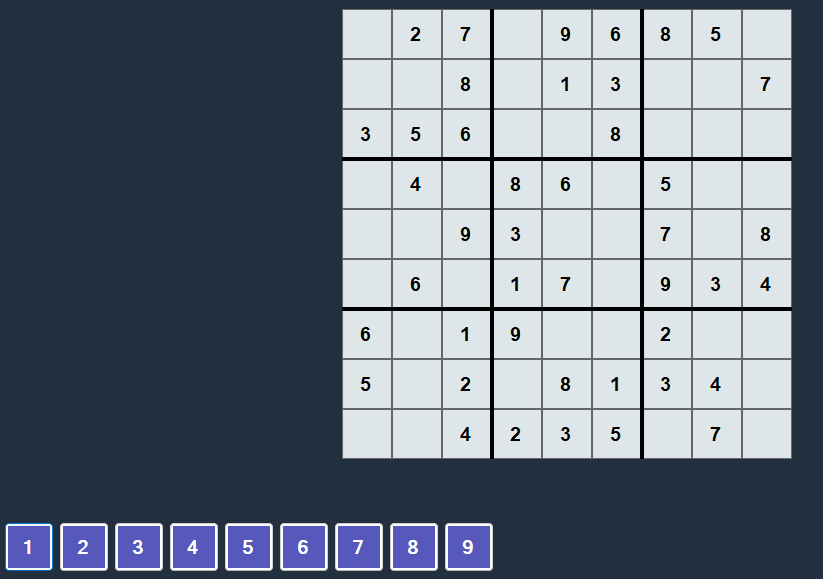

# Sudoku en C# (WinForms) (v1)



## Description

Ce projet est une application Sudoku développée en C# avec WinForms, utilisant .NET 8. Il permet de jouer à une grille générée aléatoirement avec une difficulté facile ou moyenne. L'application fournit des retours visuels pour indiquer si une saisie est correcte ou incorrecte.

## Fonctionnalités Implémentées

- **Logique du jeu** : vérification des placements corrects ou incorrects.
- **Génération de grilles aléatoires** :
  - Grilles avec une difficulté facile ou moyenne (entre 4 et 6 chiffres donnés par nombre).
- **Indications visuelles** :
  - Rouge : saisie incorrecte.
  - Vert : saisie correcte.
  - Compteur d'erreurs implémentés (v1.2)
  - Ecran de Game Over en cas de défaite (v1.2) 
  
## Fonctionnalités à Implémenter

- Gestion des victoires pour signaler la fin de la partie.
- Ajout de plusieurs niveaux de difficulté (facile, moyen, difficile).
- Amélioration de l'interface utilisateur pour une meilleure expérience.
- Gestion de bugs connus.
- Système d'astuces pour aider le joueur.
- Mode "crayon" pour écrire des hypothèses.

## Prérequis

- **Système d'exploitation** : Windows
- **.NET SDK** : version 8 ou supérieure
- **IDE recommandé** : Visual Studio

## Installation et Exécution

1. Clonez ce dépôt :
   ```bash
   git clone <url-du-repo>
   cd <nom-du-repo>
